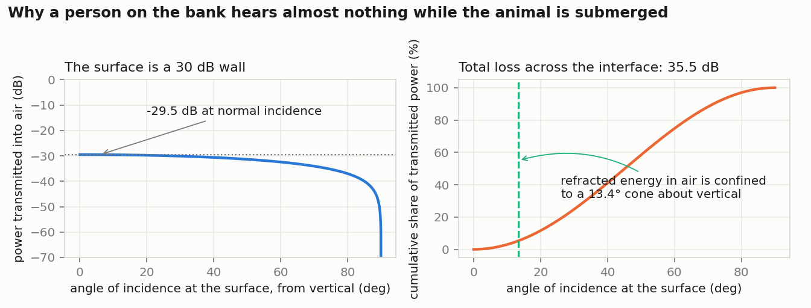
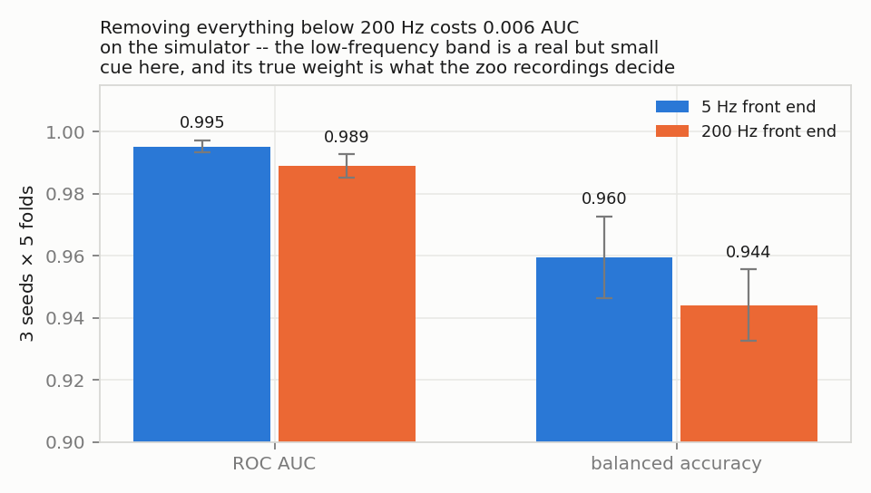
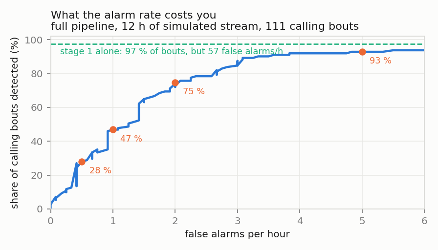
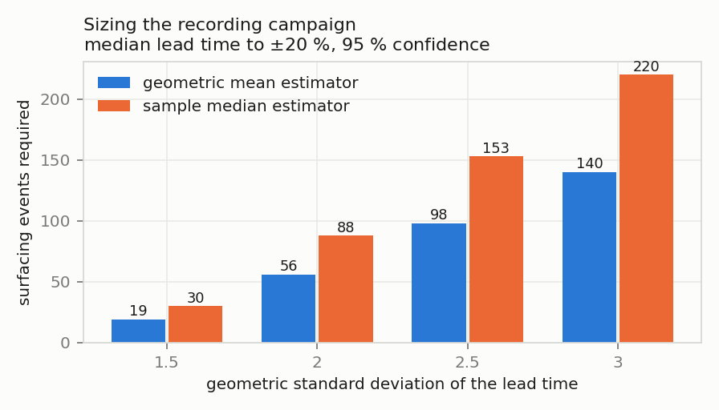
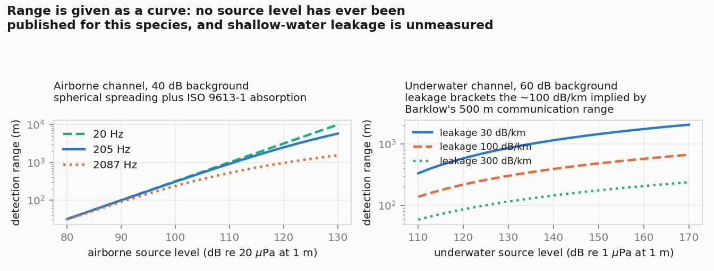

# Hippo acoustic warning

**Detecting a hippopotamus while it is still under water, so that a person on the bank gets a warning before there is anything to hear.**

---

> ### Source code is not public
>
> The detection pipeline is under active development and the work is tied to a
> partnership discussion and to pending intellectual property. The code
> repository is private. **The source is available for technical review under
> NDA** — contact me through the links at the end of this page.
>
> ### Status: concept, with measurements under way
>
> No system is deployed anywhere and there are no hippopotamus recordings in
> this project yet. Recording is under way at Emirates Park Zoo, Abu Dhabi.
> Every number on this page is either a physical calculation or a measurement
> on a simulator, and each one is labelled as such. Nothing here is a
> measurement on a hippopotamus.

---

## The problem

Hippopotamus attacks kill around 500 people a year in Africa
([Africa Check](https://africacheck.org/fact-checks/meta-programme-fact-checks/yes-hippos-kill-around-500-people-year-africa)
rates the figure true, on National Geographic and BBC estimates; there is no
systematic incident register behind it). People who live on the river read the
warning and move. Visitors do not, and they are the ones who are killed.

The acoustics make this worse than it sounds. Barklow (2004) recorded hippos on
the Ruaha and the Olifants and found that in the evening they are submerged
77 % of the time, and that **61 % of their acoustic output is produced entirely
under water, against 4 % entirely in air.** Most of what a hippo says is said in
a medium the person on the bank is not standing in.

## The physical claim, and it is only physics

A water surface is an acoustic wall. With the impedances of fresh water and
air, the plane-wave transmission coefficient is **−29.5 dB at normal
incidence**, falling steeply with angle; integrating over the upward hemisphere
gives a total loss of **35.5 dB** for a submerged omnidirectional source. What
does cross is refracted into a cone of half-angle **13.4°** about the vertical.

All three follow from the impedances alone — no fitting, no assumed source
level. This is why a hydrophone in the pool and a microphone on the bank are
not two views of the same thing: at the same range, the hydrophone has 35 dB
more signal.

Everything else in this project follows from that gap.

## The system

| Phase | What the animal is doing | Channel | A person on the bank |
|---|---|---|---|
| 1 | submerged calls, with a low-frequency component | water | hears nothing |
| 2 | surfacing, chorus roar around 205 Hz, carrying over 3 km | air | hears it — the animal is already up |
| 3 | emerging onto land | — | sees it |

The system is an attempt to move the warning from phase 3 to phase 1.

- **Hydrophone** in the water, flat below 10 Hz, is the primary sensor.
- **Air microphone** with documented low-frequency response confirms phase 2
  and gives a bearing along the bank.
- **Stage 1** is a cheap always-on trigger on the call-band envelope, running
  continuously on a low-power node.
- **Stage 2** is a small convolutional classifier over log-mel spectrograms,
  which only ever sees the windows stage 1 flagged.
- **The alarm is not a hippo sound.** Visitors do not know what a hippo warning
  sounds like — that is the whole problem — so the output is an unambiguous,
  language-independent, directional signal, duplicated visually. Playback of
  hippo vocalisations near the water is explicitly excluded: Barklow found that
  underwater playback brings submerged animals to the surface, and a system
  that triggers the behaviour it warns about is not a system.

## Results

**These are results on a simulator, not on hippos.** They exist so that the
decision rule, the thresholds and the evaluation are fixed before the real
recordings arrive, and so that the recordings are scored against a rule that
was not tuned on them.

Stage-2 classification, submerged calling bout against splashes, pump noise,
knocks and isolated resonant bursts in the same band, at −20 to +5 dB SNR,
3 seeds × 5 stratified folds:

| Front end | ROC AUC | Balanced accuracy |
|---|---|---|
| from 5 Hz | **0.995 ± 0.002** | 0.960 ± 0.013 |
| from 200 Hz (low band removed) | 0.989 ± 0.004 | 0.944 ± 0.011 |

The low-frequency band is worth 0.006 AUC here. That number is a statement
about the simulator's assumed infrasound amplitude, and it is exactly the
assumption the zoo recordings replace.

The figure that matters for a real installation is not accuracy but the
operating curve, because an alarm that cries wolf is switched off within a
month:

Over 12 simulated hours containing 111 calling bouts, the trigger alone catches
97 % of bouts at 57 false alarms an hour — useless on its own, which is the
point of the second stage. With the classifier:

| False alarms per hour | Bouts detected |
|---|---|
| 5 | 93 % |
| 2 | 75 % |
| 1 | 47 % |
| 0.5 | 28 % |

The binding constraint is the alarm rate, not the classifier.

## What is being measured at the zoo

One quantity: **the interval between the first submerged call a hydrophone can
detect and the moment the animal is at the surface.** It has never been
measured for this species. It is the entire warning the system can deliver.

Between 19 and 140 surfacing events are needed to bound the median lead time to
±20 % at 95 % confidence, depending on how variable it turns out to be; the
operationally relevant proportion — the share of approaches with a useful lead
time — needs up to 97 events. The protocol fixes synchronised hydrophone,
microphone and video on one clock, blind annotation of the acoustic onset
before the video is seen, and a double-annotated subset whose agreement is
reported as the ceiling on any detector trained against those labels.

Detection range is given as a curve rather than a number, because no source
level has ever been published for *Hippopotamus amphibius*:

## What cannot be claimed

- That the hippo's roar is infrasonic. It is not: the surface call peaks at
  205 ± 188 Hz and is perfectly audible. The infrasonic component is real but
  is reported in the submerged posture.
- That hippos produce airborne infrasound on land. Nobody has looked. Finding
  that they do not is a publishable result and is one of the outcomes this
  deployment is designed to reach.
- That the system works. It does not exist yet. The numbers above describe
  physics and a simulator.

## Precedent

Infrasonic communication in elephants was found in a zoo, with recording
equipment, before anyone documented it in the field (Payne, Langbauer & Thomas,
1986). The same route is open for this species and has not been taken.

## Sources

Barklow, W. E. (2004). *Amphibious communication with sound in hippos,
Hippopotamus amphibius.* Animal Behaviour 68, 1125–1132.

Payne, K. B., Langbauer, W. R. & Thomas, E. M. (1986). *Infrasonic calls of the
Asian elephant.* Behavioral Ecology and Sociobiology 18, 297–301.

Atmospheric absorption: ISO 9613-1:1993. Interface transmission: standard
fluid–fluid result, Kinsler, Frey, Coppens & Sanders, *Fundamentals of
Acoustics*, 4th ed., ch. 6.

## Contact

**Prof. Dr. Dmitry Mikhaylov** — Abu Dhabi, UAE

[LinkedIn](https://www.linkedin.com/in/dmitry-mikhaylov) ·
[ORCID](https://orcid.org/0009-0009-2108-6820) ·
[Substack](https://dmitrymikhaylov.substack.com)
