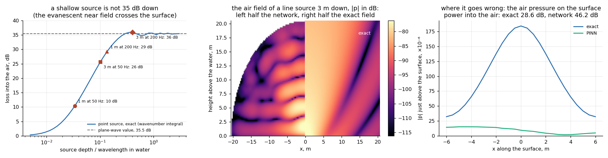

# Hippo acoustic warning

**Detecting a hippopotamus while it is still under water, so that a person on the bank gets a warning before there is anything to hear.**

*Acoustic recording under way at **Emirates Park Zoo, Abu Dhabi**.*


---

> ### Status: concept, with measurements under way
>
> No system is deployed anywhere. Acoustic recording on live animals is under
> way at **Emirates Park Zoo, Abu Dhabi**, which provides access to the hippo
> enclosure; instrumentation, protocol and analysis are mine.
>
> The recordings are not yet analysed, so **every number on this page is either
> a physical calculation or a measurement on a simulator**, and each one is
> labelled as such. Nothing here is a measurement on a hippopotamus.

---

## The problem

Hippopotamus attacks kill around 500 people a year in Africa
([Africa Check](https://africacheck.org/fact-checks/meta-programme-fact-checks/yes-hippos-kill-around-500-people-year-africa)
rates the figure true, on National Geographic and BBC estimates; there is no
systematic incident register behind it). People who live on the river read the
warning and move. Visitors do not, and they are the ones who are killed.

The acoustics make this worse than it sounds. Barklow (2004) recorded hippos on
the Ruaha and the Olifants and found that in the evening they are submerged
77 % of the time, and that **61 % of their acoustic output is produced entirely
under water, against 4 % entirely in air.** Most of what a hippo says is said in
a medium the person on the bank is not standing in.

## The physical claim, and it is only physics

A water surface is an acoustic wall. With the impedances of fresh water and
air, the plane-wave transmission coefficient is **−29.5 dB at normal
incidence**, falling steeply with angle; integrating over the upward hemisphere
gives a total loss of **35.5 dB** for a submerged omnidirectional source. What
does cross is refracted into a cone of half-angle **13.4°** about the vertical.

All three follow from the impedances alone — no fitting, no assumed source
level. This is why a hydrophone in the pool and a microphone on the bank are
not two views of the same thing: at the same range, the hydrophone has 35 dB
more signal.

Everything else in this project follows from that gap.

## The system

| Phase | What the animal is doing | Channel | A person on the bank |
|---|---|---|---|
| 1 | submerged calls, with a low-frequency component | water | hears nothing |
| 2 | surfacing, chorus roar around 205 Hz, carrying over 3 km | air | hears it — the animal is already up |
| 3 | emerging onto land | — | sees it |

The system is an attempt to move the warning from phase 3 to phase 1.

- **Hydrophone** in the water, flat below 10 Hz, is the primary sensor.
- **Air microphone** with documented low-frequency response confirms phase 2
  and gives a bearing along the bank.
- **Stage 1** is a cheap always-on trigger on the call-band envelope, running
  continuously on a low-power node.
- **Stage 2** is a small convolutional classifier over log-mel spectrograms,
  which only ever sees the windows stage 1 flagged.
- **The alarm is not a hippo sound.** Visitors do not know what a hippo warning
  sounds like — that is the whole problem — so the output is an unambiguous,
  language-independent, directional signal, duplicated visually. Playback of
  hippo vocalisations near the water is explicitly excluded: Barklow found that
  underwater playback brings submerged animals to the surface, and a system
  that triggers the behaviour it warns about is not a system.

## Results

**These are results on a simulator, not on hippos.** They exist so that the
decision rule, the thresholds and the evaluation are fixed before the real
recordings arrive, and so that the recordings are scored against a rule that
was not tuned on them.

Stage-2 classification, submerged calling bout against splashes, pump noise,
knocks and isolated resonant bursts in the same band, at −20 to +5 dB SNR,
3 seeds × 5 stratified folds:

| Front end | ROC AUC | Balanced accuracy |
|---|---|---|
| from 5 Hz | **0.995 ± 0.002** | 0.960 ± 0.013 |
| from 200 Hz (low band removed) | 0.989 ± 0.004 | 0.944 ± 0.011 |


The low-frequency band is worth 0.006 AUC here. That number is a statement
about the simulator's assumed infrasound amplitude, and it is exactly the
assumption the zoo recordings replace.

The figure that matters for a real installation is not accuracy but the
operating curve, because an alarm that cries wolf is switched off within a
month:


Over 12 simulated hours containing 111 calling bouts, the trigger alone catches
97 % of bouts at 57 false alarms an hour — useless on its own, which is the
point of the second stage. With the classifier:

| False alarms per hour | Bouts detected |
|---|---|
| 5 | 93 % |
| 2 | 75 % |
| 1 | 47 % |
| 0.5 | 28 % |

The binding constraint is the alarm rate, not the classifier.

## The study at Emirates Park Zoo

Emirates Park Zoo in Abu Dhabi holds hippopotamuses in a pool that can be
instrumented, observed continuously and filmed — which a river cannot. The zoo
provides access to the enclosure; the hydrophone, the microphone, the recording
protocol and the analysis are mine.

The study measures one quantity: **the interval between the first submerged call a hydrophone can
detect and the moment the animal is at the surface.** It has never been
measured for this species. It is the entire warning the system can deliver.


Between 19 and 140 surfacing events are needed to bound the median lead time to
±20 % at 95 % confidence, depending on how variable it turns out to be; the
operationally relevant proportion — the share of approaches with a useful lead
time — needs up to 97 events. The protocol fixes synchronised hydrophone,
microphone and video on one clock, blind annotation of the acoustic onset
before the video is seen, and a double-annotated subset whose agreement is
reported as the ceiling on any detector trained against those labels.

Detection range is given as a curve rather than a number, because no source
level has ever been published for *Hippopotamus amphibius*:


## The physics, one step further: a shallow source is not 35 dB down



The 35.5 dB above is a plane-wave number. It is exact for a source many
wavelengths below the surface, where the field arriving at the interface is
a sum of propagating plane waves and Snell's law and the impedance ratio
decide everything. A hippopotamus is not many wavelengths down. At 50 Hz the
wavelength in water is 30 m; an animal calling at 1–3 m is a small fraction
of a wavelength from the surface, and there the field at the interface is
dominated by *evanescent* components — the near field of the source — which
the plane-wave calculation does not contain. The acoustics literature calls
the consequence "anomalous transparency" (Godin, 2006–2008): a shallow
source loses far less into the air than the plane-wave figure says.

**Exact result.** The two-medium problem for a point source under a flat
water–air interface has a closed form as a wavenumber integral (the
Sommerfeld representation, with the plane-wave reflection and transmission
coefficients under the integral). The fraction of the source's radiated
power that crosses into the air depends only on depth measured in
wavelengths:

| source depth / λ | loss into the air | example |
|---|---|---|
| 0.01 | 1.4 dB | |
| 0.03 | 9.0 dB | 1 m at 50 Hz: 10 dB |
| 0.1 | 25 dB | 3 m at 50 Hz: 26 dB; 1 m at 200 Hz: 29 dB |
| 0.3 and deeper | 35.5 dB | 3 m at 200 Hz — the plane-wave value |

The deep limit reproduces the plane-wave 35.5 dB to 0.1 dB, which is the
check that the integral is right; the field it produces satisfies both
interface conditions (pressure and normal velocity continuous) to 1 %, and
with the interface removed it collapses to the free-field source. The
shallow end changes the sensor argument: for the low-frequency part of a
submerged call — the part the project is built around — an animal a metre
down is 10 dB below the surface, not 35. The hydrophone's advantage over the
bank microphone is real at every depth, but at the depths and frequencies
that matter it is 10–25 dB, not a fixed 35.

**The PINN, and what it did not do.** The integral only exists for a flat
surface. A river bank slopes, and a pool has walls; for those there is no
closed form, and that is where a physics-informed network would earn its
keep. `src/interface_pinn.py` builds one: two networks, one per medium, each
obeying the Helmholtz equation for its own wavenumber; the source and its
mirror image added in closed form, so the singularity never enters the loss
and the water network only carries a correction of order ρ_air/ρ_water; the
velocity-continuity condition built into the air network's architecture as a
hard constraint (its normal derivative at the surface *is* the analytic
Neumann data, by construction); a second-order Bayliss–Turkel radiation
condition on half-disc arcs. It is scored against the exact field for a
line source 3 m down.

| quantity, line source 3 m down at 50 Hz | exact | PINN |
|---|---|---|
| fraction of power into the air | 28.6 dB | 46.2 dB |
| relative field error, water | — | 0.5 % |
| relative field error, air | — | 79 % |

The network gets the water right (the analytic image does the work) and
the air wrong by a factor of three in amplitude, with the Helmholtz
residual, the interface conditions and the radiation condition all
satisfied to a few percent. That combination is the diagnosis: the network
solved a *different* well-posed problem. The air field of a shallow line
source is not a compact beam; the transmitted field runs along the surface
and decays slowly with distance (the exact surface pressure 6 m from the
source is still a fifth of its peak), so a half-disc of three air
wavelengths with an outgoing-wave condition on its arc cuts into the source
region itself, and the truncated problem has less power in it. Four earlier
formulations failed for reasons worth recording: a soft interface loss let
the network match the normal velocity with a thin boundary layer of tiny
amplitude while violating the wave equation next to the surface (residual
10–90 % of k²p a metre up, invisible in the domain-averaged loss); Fourier
features far above the wavenumber made the second derivatives noisy; a
box with a first-order radiation condition reflected grazing energy; and
one "hard constraint" quietly imposed a zero-pressure condition nobody had
asked for. Each was found by comparing against the exact field, which is
the point of having one.

The sloping-bank cases were therefore not run: a network that does not
reproduce the flat surface has not earned a surface without a reference.
What it would take is a domain several times the surface footprint — of
order a hundred metres at 50 Hz — or a boundary-integral formulation that
carries the infinite surface analytically; both are noted, neither is done
here.

The exact comparison is in two dimensions (a line source), which is what
the network solves; the 35.5 dB and the table above it are for a point
source. The two geometries differ in their deep limit by one decibel (34.4
versus 35.5 dB) and agree on the shape of the shallow-source curve.

## What cannot be claimed

- That the hippo's roar is infrasonic. It is not: the surface call peaks at
  205 ± 188 Hz and is perfectly audible. The infrasonic component is real but
  is reported in the submerged posture.
- That hippos produce airborne infrasound on land. Nobody has looked. Finding
  that they do not is a publishable result and is one of the outcomes this
  deployment is designed to reach.
- That the system works. It does not exist yet. The numbers above describe
  physics and a simulator.

## Precedent

Infrasonic communication in elephants was found in a zoo, with recording
equipment, before anyone documented it in the field (Payne, Langbauer & Thomas,
1986). The same route is open for this species and has not been taken: a zoo,
a hydrophone, and enough patient hours.

A captive pool fixes the call repertoire, the postures, the lead-time
distribution and the presence or absence of an airborne low-frequency
component. It cannot fix propagation ranges in a river, the source levels of a
wild animal, or how a territorial male behaves toward a stranger on a bank.
Those need a field site and are outside this study.

## Sources

Barklow, W. E. (2004). *Amphibious communication with sound in hippos,
Hippopotamus amphibius.* Animal Behaviour 68, 1125–1132.

Payne, K. B., Langbauer, W. R. & Thomas, E. M. (1986). *Infrasonic calls of the
Asian elephant.* Behavioral Ecology and Sociobiology 18, 297–301.

Atmospheric absorption: ISO 9613-1:1993. Interface transmission: standard
fluid–fluid result, Kinsler, Frey, Coppens & Sanders, *Fundamentals of
Acoustics*, 4th ed., ch. 6.

## Source code

The physics is public in this repository:

- `src/propagation.py` — the interface loss, refraction cone, atmospheric
  absorption (ISO 9613-1), transmission loss and detection range
- `src/interface_pinn.py` — the exact wavenumber-integral solution for a
  source under the surface, and the physics-informed network that was
  scored against it
- `src/interface_figure.py` — the figure above
- `tests/test_interface.py` — six checks: the deep limit reproduces the
  plane-wave loss, the transparency depends only on depth in wavelengths,
  the exact field reduces to the free field without an interface and
  satisfies both interface conditions, and the network's result is what
  the page says it is

The detection pipeline (synthetic hippo-call generator, the classifier,
the stream evaluation and the lead-time sizing) is held in a private
repository while the zoo recordings are analysed.

```
pip install -r requirements.txt
python tests/test_interface.py
python src/interface_pinn.py      # exact curves in seconds; the network ~30 min on a laptop CPU
```

## Licence

Documentation, figures and result files: CC BY 4.0. Source code in `src/`
and `tests/`: MIT. No recordings are included.

## Contact

**Prof. Dr. Dmitry Mikhaylov** — Abu Dhabi, UAE

[LinkedIn](https://www.linkedin.com/in/dmitry-mikhaylov) ·
[ORCID](https://orcid.org/0009-0009-2108-6820) ·
[Substack](https://dmitrymikhaylov.substack.com)
